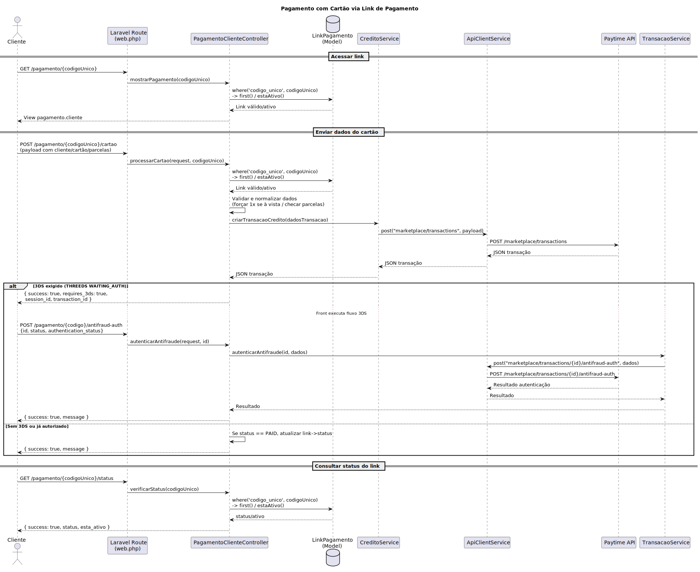

# Fluxo de Pagamento com Cartão de Crédito

Fluxo implementado para pagamento com cartão de crédito, com as classes/métodos envolvidos e um diagrama de sequência em **PlantUML**.

---

## 🧩 Classes e Métodos

### Rotas

| Arquivo | Método | Rota | Controller / Ação |
|----------|---------|------|-------------------|
| `routes/web.php:28` | `GET` | `/pagamento/{codigoUnico}` | `PagamentoClienteController@mostrarPagamento` |
| `routes/web.php:29` | `POST` | `/pagamento/{codigoUnico}/cartao` | `PagamentoClienteController@processarCartao` |
| `routes/web.php:30` | `GET` | `/pagamento/{codigoUnico}/status` | `PagamentoClienteController@verificarStatus` |
| `routes/web.php:162` | `POST` | `/pagamento/{codigo}/antifraud-auth` | `PagamentoClienteController@autenticarAntifraude` |

---

### Controller Público (Link de Pagamento)

| Arquivo | Linha | Método | Descrição |
|----------|--------|---------|------------|
| `app/Http/Controllers/PagamentoClienteController.php:35` | `mostrarPagamento($codigoUnico)` | Carrega `LinkPagamento`, verifica se está ativo e renderiza `pagamento.cliente`. |
| `app/Http/Controllers/PagamentoClienteController.php:59` | `processarCartao(Request $request, $codigoUnico)` | Valida o request, saneia máscaras, força 1x se “à vista”, monta payload e chama `CreditoService@criarTransacaoCredito`. Trata possível 3DS e atualiza status do link se “PAID”. |
| `app/Http/Controllers/PagamentoClienteController.php:471` | `verificarStatus($codigoUnico)` | Retorna o status do link. |
| `app/Http/Controllers/PagamentoClienteController.php:493` | `autenticarAntifraude(Request $request, $id)` | Envia resultado do 3DS para a API via `TransacaoService@autenticarAntifraude`. |

---

### Modelo

| Arquivo | Linha | Método | Descrição |
|----------|--------|---------|------------|
| `app/Models/LinkPagamento.php:63` | `estaAtivo()` | Regra de ativação (status e expiração). |
| `app/Models/LinkPagamento.php:79` | `getUrlCompletaAttribute()` | Retorna a URL completa do link. |

---

### Serviços e Integração (Gateway)

| Arquivo | Linha | Método | Descrição |
|----------|--------|---------|------------|
| `app/Services/CreditoService.php:16` | `criarTransacaoCredito(array $dados)` | `POST marketplace/transactions` — cria a transação de crédito. |
| `app/Services/TransacaoService.php:89` | `autenticarAntifraude(string $idTransacao, array $dados)` | `POST marketplace/transactions/{id}/antifraud-auth` — autenticação 3DS. |
| `app/Services/ApiClientService.php:24` | `post($endpoint, $payload)` | Cliente HTTP com headers (`token`, `x-token`, `integration-key`) e retry em 401. |
| `app/Services/ApiClientService.php:19`, `39` | `get(...)`, `request(...)` | Utilitários de requisição. |

---

## 🔁 Fluxo Resumido

1. **Cliente** acessa o link público e carrega a página (`mostrarPagamento`).
2. No **submit do cartão** (`POST`), o método `processarCartao`:
   - Valida e normaliza os dados.
   - Garante parcelas válidas para o link.
   - Monta `dadosTransacao` e chama `CreditoService@criarTransacaoCredito`.
3. Se a resposta indicar **3DS** (`antifraude THREEDS`, `WAITING_AUTH`):
   - Retorna `requires_3ds`, `session_id` e `transaction_id`.
4. Caso aprovado **sem 3DS** e status seja `PAID`:
   - Atualiza o `LinkPagamento` e retorna sucesso.
5. Se houve **3DS**, o front finaliza a autenticação e chama  
   `POST /pagamento/{codigo}/antifraud-auth`, que aciona  
   `TransacaoService@autenticarAntifraude` e retorna o resultado.

---

## Diagrama de Sequência

## 📝 Observações

- **Gateway:** integração central via `ApiClientService` com headers:
  - `Authorization` (token renovado automaticamente)
  - `x-token`
  - `integration-key`

- **3DS:**  
  A detecção e disparo do fluxo ocorre no **backend** (retorno `requires_3ds`),  
  mas a autenticação é finalizada no **frontend** e confirmada pelo endpoint público  
  `pagamento.antifraud-auth`.

- **Atualização de status do link:**  
  Ocorre quando a resposta da transação vem com status **PAID**.
